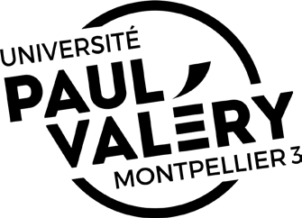
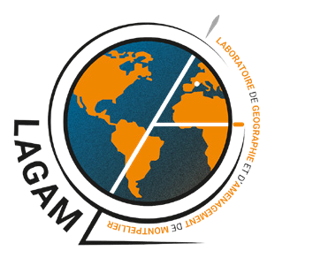
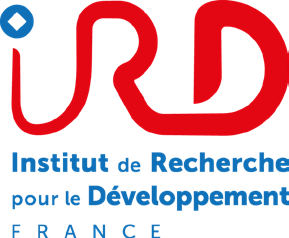
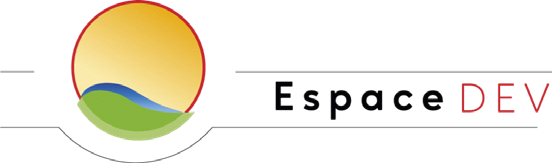

# Tsunami Mamoudzou — simulation multi-agents et réalité virtuelle

**Un environnement immersif en réalité virtuelle couplé à une simulation multi-agents GAMA, pour sensibiliser au risque tsunami à Mayotte.**

Projet mené dans le cadre du programme de recherche **PEPR IRIMA ROM**, par le **LAGAM** (Laboratoire de Géographie et Aménagement de Montpellier) en collaboration avec l'**IRD / UMR ESPACE-DEV**.

> Ce dépôt sert de **point d'entrée** au projet : il ne contient pas de code. Chaque brique (modèle GAMA, projet Unity, middleware SIMPLE) vit dans son propre dépôt, listés ci-dessous.

---

## En bref

Mayotte fait face à un risque tsunami réel depuis l'émergence, en 2018, du volcan sous-marin Fani Maoré. Le LAGAM et l'IRD développent une simulation multi-agents (GAMA) de l'évacuation piétonne à Mamoudzou, capable de tester différentes stratégies d'alerte et de mesurer leur effet sur la mise en sécurité de la population.

Ce projet ajoute à cette simulation scientifique une **couche immersive** : un environnement 3D de Mamoudzou en réalité virtuelle, couplé en temps réel à la simulation GAMA, pensé comme un dispositif de sensibilisation destiné à un public de collégiens plutôt que comme un simple outil de recherche.

## Les briques du projet

| Brique | Rôle | Dépôt |
|---|---|---|
| **GAMA** (plateforme) | Le moteur de simulation multi-agents sur lequel tout repose | [gama-platform/gama](https://github.com/gama-platform/gama) |
| **SIMPLE Toolchain** | Chaîne générique développée par Project SIMPLE pour connecter GAMA à Unity en VR (plugin GAMA + template Unity) | [project-SIMPLE/simple.toolchain](https://github.com/project-SIMPLE/simple.toolchain) |
| **SIMPLE WebPlatform** | Serveur de gestion des connexions temps réel entre GAMA et Unity | [project-SIMPLE/simple.webplatform](https://github.com/project-SIMPLE/simple.webplatform) |
| **Modèle GAMA Tsunami Mayotte** | Simulation d'évacuation de Mamoudzou, modèle GAML étendu pour le jeu VR | [chapuisk/Tsunami](https://github.com/chapuisk/Tsunami) |
| **Projet Unity VR** (ce stage) | L'environnement immersif développé durant ce stage, construit sur le template Unity de SIMPLE | [ojemaje/VR_Game_Unity_Tsunami](https://github.com/ojemaje/VR_Game_Unity_Tsunami) |

### Le convertisseur terrain (OBJ → TIF)

Le projet Unity embarque un outil qui exporte le terrain Unity au format OBJ. Ce fichier est ensuite converti en TIF par un script externe, avant d'être placé manuellement dans le projet GAMA Tsunami Mayotte, à la place du fichier TIF existant. Cette étape permet de mettre à jour le terrain utilisé par la simulation, pour que les agents GAMA se déplacent en tenant compte du relief effectivement modélisé dans Unity.

## Game design : une simulation vécue à trois rôles

Plutôt qu'un joueur unique face à une simulation, le dispositif répartit l'expérience sur trois rôles complémentaires, qui reflètent chacun un maillon réel de la chaîne d'alerte tsunami :

- **Le Terrain** — un joueur en immersion VR, sur le casque, qui vit la crise au sol à Mamoudzou.
- **Le Poste** — un opérateur qui suit la situation sur un écran (GAMA), sans jamais voir l'environnement 3D directement.
- **Le Réseau** — des observateurs, avec des fiches papier, qui interprètent les signaux et guident le Poste.

Le détail complet de cette conception (boucles de gameplay, structure en deux temps, système forme/couleur) est développé dans le mémoire de stage associé au projet.

## Architecture technique

```
GAMA model (.gaml)  →  middleware SIMPLE  →  Unity VR app (casque Meta Quest)
   [ws :1000]           WebPlatform            [ws :8080]
```

Le plugin GAMA envoie les données de simulation (positions, terrain, messages) au travers de la WebPlatform vers Unity. Unity renvoie en retour les interactions du joueur (position, actions) par le même canal.

Détail complet : [doc.project-simple.eu/overview/architecture](https://doc.project-simple.eu/overview/architecture)

## État d'avancement

Le projet en est au stade d'une **Vertical Slice** : un segment jouable et représentatif de l'expérience finale. La chaîne technique (terrain, capture photo, couplage GAMA/Unity) est fonctionnelle ; la conception de la boucle de gameplay à trois rôles reste à prototyper et tester auprès d'un public réel.

## Contexte du projet

Ce travail a été mené dans le cadre d'un stage de Technical Artist (avril–octobre 2026), par Matiss Corrigou, étudiant en Licence Professionnelle Métiers du Jeu Vidéo à l'Université de Montpellier Paul-Valéry. Le mémoire de stage complet, qui détaille l'ensemble de la démarche (contexte scientifique, choix de game design, réalisation technique et limites du projet), est disponible dans le dossier [`memoire/`](Memoire/) de ce dépôt et un teaser vidéo de l'environnement dans [`media/`](Media/) qui illustre la reconstitution 3D de Mamoudzou.

Une synthèse de ce travail, pensée pour la soutenance, est disponible sous forme de présentation interactive dans le dossier [`presentation/`](Presentation/), et consultable directement en ligne : 

## Remerciements

Frédéric Leone (tuteur de stage, LAGAM) · Kévin Chapuis (encadrant, IRD / ESPACE-DEV, créateur principal de la simulation GAMA) · Noé Carles (LAGAM, travaux sur les canaux d'alerte et la plateforme web de valorisation des scénarios) · Claire Siegel (référente pédagogique, Université Paul-Valéry Montpellier 3)

---

<p align="center">
  
  &nbsp;&nbsp;
  
  &nbsp;&nbsp;
  
  &nbsp;&nbsp;
  
</p>
